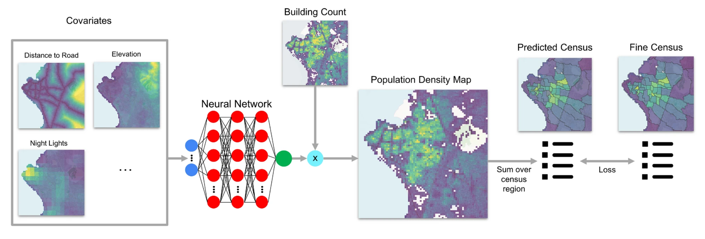
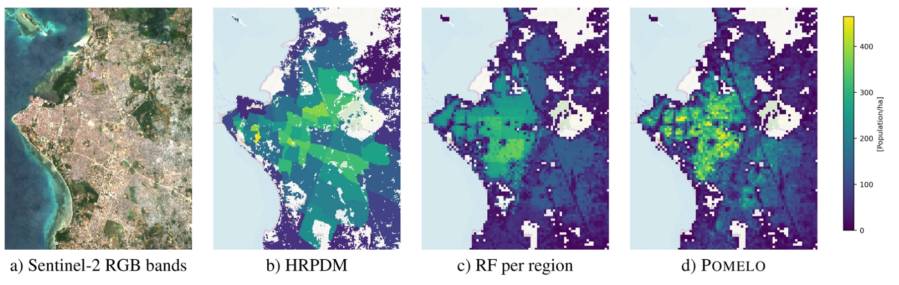
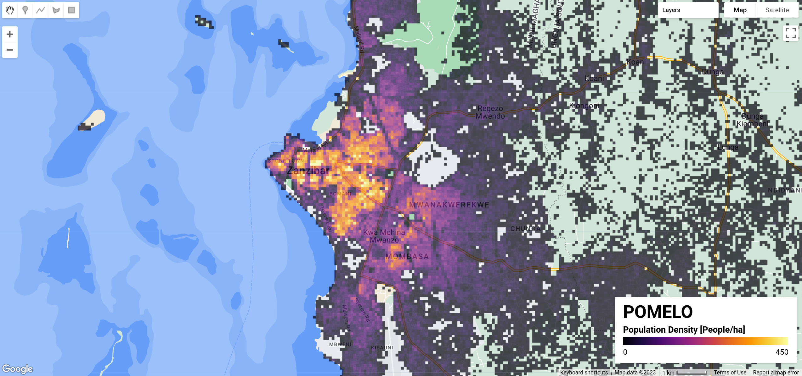

# [POMELO](https://www.nature.com/articles/s41598-022-24495-w): Fine-grained Population Mapping from Coarse Census Counts and Open Geodata




This code repository shows how to obtain population estimations using the POMELO model - a result of the paper [Fine-grained Population Mapping from Coarse Census Counts
and Open Geodata](https://www.nature.com/articles/s41598-022-24495-w). In the following paragraphs, we describe the software requirements, the required input data, and how to use the scripts to generate population maps for a given country, taking as an example the country of Tanzania.


---

## TL;DR: How to Download Population Maps

You have multiple options for accessing the population maps for Tanzania, Mozambique, Uganda, Rwanda, and Zambia:

### Direct Download

- **Format**: `.tif`
- **Link**: [Download Here](https://drive.google.com/drive/folders/1KT8F0tytUMw7PjKQ_cxD1AmQMo1zchfX?usp=sharing)

### Google Earth Engine

- **Code Sample**: 
  ```javascript
  var popDensity = ee.Image("projects/ee-nandometzger/assets/POMELOv1");
  ```
  
- **Community Dataset Documentation**: For more details on the Google Earth Engine dataset, you can visit the [GEE Community Catalog page](https://gee-community-catalog.org/projects/pomelo/).

### Demo Interface

- **Explore Online**: [Demo Interface](https://ee-nandometzger.projects.earthengine.app/view/pomelo)
  

---

## Software requirements

POMELO is implemented in Python, and some libraries need to be installed before using it. You can set up a virtual environment with all the required Python libraries by running the following commands in a terminal (on a computer with Linux OS).

```
virtualenv -p python3 pomelo_env
source pomelo_env/bin/activate
pip install numpy torch matplotlib h5py wandb tqdm torchvision fiona sklearn gdal==3.2.1
```
---

## Input data

> TL:DR: If you just want to train/evaluate the model, you can download the preprocessed dataset [here](https://drive.google.com/drive/folders/1ArQ_qEq26hXpjlRLzi36ZPUUVB_VcMUx?usp=sharing) and carefully set the paths in the `config_pop.py` folder. If you want to run it with your data. Please read the description on how to reproduce the dataset.

As described in the POMELO paper we used, as input variables (covariates) of our model, geodata that is publicly available. The full list of input data is shown in [Table 4](https://www.nature.com/articles/s41598-022-24495-w/tables/4) of the POMELO paper (e.g., building counts, and night light images). The input data is stored in georeferenced raster images of the same spatial resolution (i.e., 100 m x 100 m). Most of the input data can be downloaded from the [WorldPop website](https://hub.worldpop.org/project/categories?id=14), the Google buildings from [here](https://sites.research.google/open-buildings/) and building data from [Gridded maps of building patterns](https://data.worldpop.org/repo/wopr/_MULT/buildings/v1.1/). 

Once you downloaded this code repository you will need to edit the file `config_pop.py` to specify where the raster input data is located. To do that we need to edit the python dictionary `input_paths` by adding/editing an entry with the code of the country as key and another dictionary as a value. As the following partial example:

```
input_paths = {
    "tza": {
        "buildings_google" : "path_of_raster_building_counts_google",
        "buildings_maxar" : "path_of_raster_building_counts_maxar",
        "buildings_google_mean_area" : "path_of_raster_buildings_mean_area_google",
        "buildings_maxar_mean_area" : "path_of_raster_buildings_mean_area_maxar",
        ...
    }
}
```

After setting all the file paths of the input variables you also need to specify which are the "no data" values in the input raster images. This can be done by editing the Python variable `no_data_values` in the file `config_pop.py`. There are already some predefined values, but you can edit them. Finally, in order to normalize the input data it is also needed to provide normalization values for each feature. In order to normalize the values we subtract each feature value by the defined mean and divide it by the defined standard deviation. Currently, those variables were computed for the country of Tanzania and used for all the other countries to facilitate multi-country analysis, but you can also define different means and standards deviation values by editing the variable `norms` in the file `config_pop.py`

Apart from the input data that correlates with the population density, you also need to collect census data, since it is the target of the POMELO model. Census data is usually publicly available but is frequently stored in heterogeneous formats.
For instance, for the country of Tanzania, we used the census data (United Nations projections for 2020 computed from the census of 2012). 

The census data and information about the administrative boundaries are used as input for the script `preprocessing_pop_data.py` that saves, into a file of format `pickle`, information about census counts of administrative regions (e.g., for Tanzania a file named `preprocessed_census_data_tza.pkl`). For the users convenience, we host all preprocessed census [here](https://drive.google.com/drive/folders/1nhB2jcXOIMlK__PSvHuSJqvaGlzbbpZ6?usp=sharing), such that this preprocessing step can be omitted. This file is used as input for the script `superpixel_disagg_model.py` that trains the population model. 

---

## Estimating population maps

In the POMELO paper, we describe two strategies to train and evaluate the model with the available data:
The `coarse level` training is conducted to analyze the capabilities of POMELO and the `fine level` training which is relevant in practice.
In this document, we will describe the instructions to train the POMELO model using the `fine level` approach.
In this strategy, the finest available level of census data is split into a train, validation, and test set using cross-validation, with five folds: three folds for the training set, one for validation, and the remaining one for testing.
So, we will need to run five times the script (called `superpixel_disagg_model.py`) that trains the POMELO model, once for each different train/val/test configuration. The following commands train the POMELO model, using cross-validation.

```
python superpixel_disagg_model.py -train tza -train_lvl f -test tza -wr 0.01 --dropout 0.4 -lstep 800 --validation_fold 0 -rs 42 -mm m --loss LogL1 --dataset_dir datasets --sampler custom --max_step 150000 --name TZA_fine_vfold0
python superpixel_disagg_model.py -train tza -train_lvl f -test tza -wr 0.01 --dropout 0.4 -lstep 800 --validation_fold 1 -rs 42 -mm m --loss LogL1 --dataset_dir datasets --sampler custom --max_step 150000 --name TZA_fine_vfold1
python superpixel_disagg_model.py -train tza -train_lvl f -test tza -wr 0.01 --dropout 0.4 -lstep 800 --validation_fold 2 -rs 42 -mm m --loss LogL1 --dataset_dir datasets --sampler custom --max_step 150000 --name TZA_fine_vfold2
python superpixel_disagg_model.py -train tza -train_lvl f -test tza -wr 0.01 --dropout 0.4 -lstep 800 --validation_fold 3 -rs 42 -mm m --loss LogL1 --dataset_dir datasets --sampler custom --max_step 150000 --name TZA_fine_vfold3
python superpixel_disagg_model.py -train tza -train_lvl f -test tza -wr 0.01 --dropout 0.4 -lstep 800 --validation_fold 4 -rs 42 -mm m --loss LogL1 --dataset_dir datasets --sampler custom --max_step 150000 --name TZA_fine_vfold4
```

We specify the country `-train tza`, the training strategy `-train_lvl f` (`fine level` approach), the index of the fold that corresponds to the validation set `--validation_fold 3`, the name of the trained model `--name TZA_fine_vfold0`, and the main neural network hyper-parameter values. For instance, when using `--validation_fold 3`, the first three folds are used for training the fourth fold for validation and the fifth is reserved for testing. Each time the script `superpixel_disagg_model.py` finishes executing it saves the trained models into a file in the directory `checkpoints`}.

Finally, to obtain the population estimations for the whole country, which collect and merge the previously trained models by executing again `superpixel_disagg_model.py`, but now passing the parameter `-e5f` and listing the name of the trained models separated by commas, and a flag that indicates which metric to consider to select the trained model `--e5f_metric best_mape` (e.g., model that obtains the best MAPE metric in the validation set). For all the other parameters we use the same values used during training. 

```
python superpixel_disagg_model.py -train tza -train_lvl f -test tza -wr 0.01 --dropout 0.4 -lstep 800 --validation_fold 0 -rs 42 -mm d --loss LogL1 --dataset_dir datasets --sampler custom --max_step 150000 --name TZA_fine_allfolds --e5f_metric best_mape -e5f TZA_fine_vfold0,TZA_fine_vfold1,TZA_fine_vfold2,TZA_fine_vfold3,TZA_fine_vfold4
```

---

## Citation

If this code and/or data is useful for you, please cite our paper:
```
@article{metzger2022fine,
  title={Fine-grained population mapping from coarse census counts and open geodata},
  author={Metzger, Nando and Vargas-Mu{\~n}oz, John E. and Daudt, Rodrigo C. and Kellenberger, Benjamin and Whelan, Thao Ton-That and Ofli, Ferda and Imran, Muhammad and Schindler, Konrad and Tuia, Devis},
  journal={Scientific Reports},
  volume={12},
  number={1},
  pages={20085},
  year={2022},
  publisher={Nature Publishing Group UK London}
}
```
